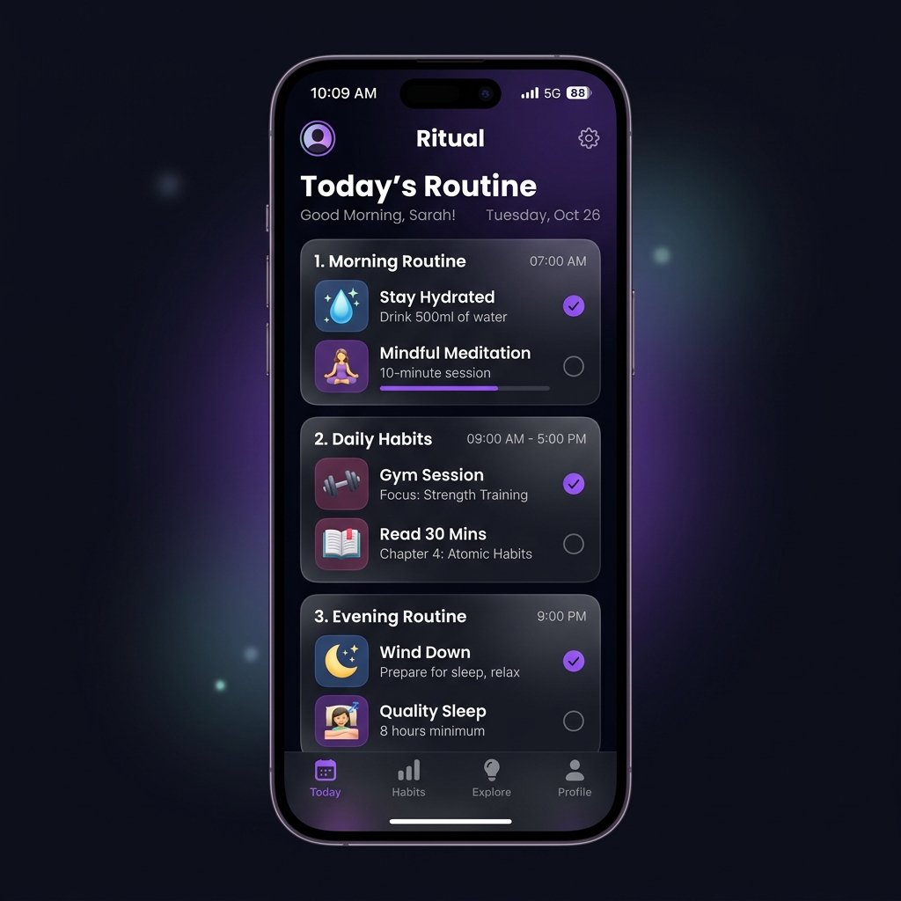

# RoutineOS 🚀
Your ultimate daily routine manager with cloud synchronization, background push notifications, and productivity analytics.

## ✨ Features
- **Cloud Sync:** Securely store your routines in MongoDB and access them from any device.
- **Push Notifications:** Never miss a routine with timezone-aware background alerts (Web Push API).
- **Focus Timer:** Built-in Pomodoro-style timer with custom presets and auto-break logic.
- **Analytics:** Visualize your progress with beautiful charts (Chart.js).
- **Modern UI:** Sleek, glassmorphic design with dark/light mode support.
- **PWA Ready:** Install it on your Android or iPhone for a native app experience.

## 🛠️ Technology Stack
- **Frontend:** Vanilla JS, Tailwind CSS, Chart.js.
- **Backend:** Node.js, Express.
- **Database:** MongoDB Atlas.
- **Push Engine:** Web Push (VAPID).

## 🚀 Getting Started
1. Clone the repo: `git clone https://github.com/rishav2000106-prog/daily-routine.git`
2. Install dependencies: `npm install`
3. Set up environment variables (VAPID keys, MongoDB URI).
4. Run locally: `npm start`

## 🤝 How to Contribute
1. Fork the project.
2. Create your Feature Branch (`git checkout -b feature/AmazingFeature`).
3. Commit your changes (`git commit -m 'Add some AmazingFeature'`).
4. Push to the Branch (`git push origin feature/AmazingFeature`).
5. Open a Pull Request.

---
*Built with ❤️ for productivity.*
